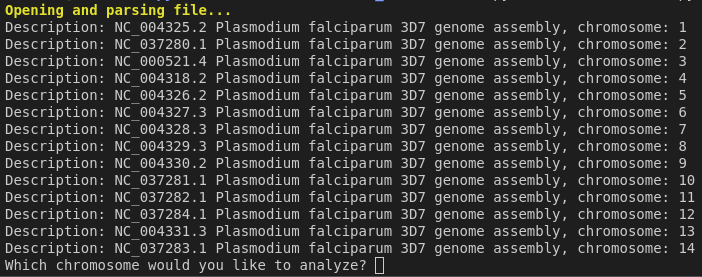
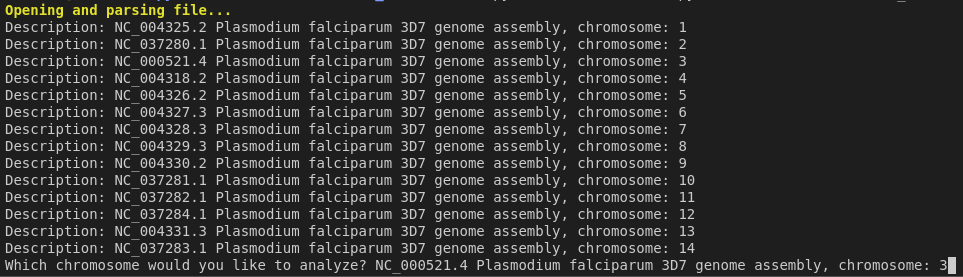
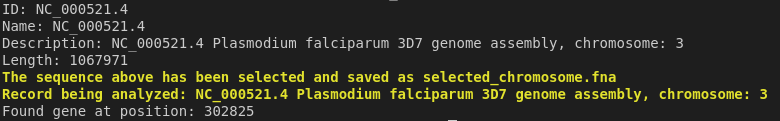

<!-- Improved compatibility of back to top link: See: https://github.com/othneildrew/Best-README-Template/pull/73 -->
<a name="readme-top"></a>
<!--
*** Thanks for checking out the Best-README-Template. If you have a suggestion
*** that would make this better, please fork the repo and create a pull request
*** or simply open an issue with the tag "enhancement".
*** Don't forget to give the project a star!
*** Thanks again! Now go create something AMAZING! :D
-->


<!-- PROJECT SHIELDS -->
<!--
*** I'm using markdown "reference style" links for readability.
*** Reference links are enclosed in brackets [ ] instead of parentheses ( ).
*** See the bottom of this document for the declaration of the reference variables
*** for contributors-url, forks-url, etc. This is an optional, concise syntax you may use.
*** https://www.markdownguide.org/basic-syntax/#reference-style-links
-->
[![Contributors][contributors-shield]][contributors-url]
[![Forks][forks-shield]][forks-url]
[![Stargazers][stars-shield]][stars-url]
[![Issues][issues-shield]][issues-url]
[![MIT License][license-shield]][license-url]
[![LinkedIn][linkedin-shield]][linkedin-url]


<!-- PROJECT LOGO -->
<br />
<div align="center">
  <a href="https://github.com/walla-42/Gene_Search">
    
  </a>

<h3 align="center">Gene Search</h3>

  <p align="center">
    This project is aimed at idenifying genes located in prokaryotic organisms and identifying single exon genes in eukaryotic organisms. 
    <br />
    <a href="https://github.com/walla-42/Gene_Search"><strong>Explore the docs »</strong></a>
    <br />
    <br />
    <a href="https://github.com/walla-42/Gene_Search">View Demo</a>
    ·
    <a href="https://github.com/walla-42/Gene_Search/issues/new?labels=bug&template=bug-report---.md">Report Bug</a>
    ·
    <a href="https://github.com/walla-42/Gene_Search/issues/new?labels=enhancement&template=feature-request---.md">Request Feature</a>
  </p>
</div>


<!-- TABLE OF CONTENTS -->
<details>
  <summary>Table of Contents</summary>
  <ol>
    <li>
      <a href="#about-the-project">About The Project</a>
      <ul>
        <li><a href="#built-with">Built With</a></li>
      </ul>
    </li>
    <li>
      <a href="#getting-started">Getting Started</a>
      <ul>
        <li><a href="#prerequisites">Prerequisites</a></li>
        <li><a href="#installation">Installation</a></li>
      </ul>
    </li>
    <li><a href="#usage">Usage</a></li> 
    <li><a href="#roadmap">Roadmap</a></li>
    <li><a href="#contributing">Contributing</a></li>
    <li><a href="#license">License</a></li>
    <li><a href="#contact">Contact</a></li>
    <li><a href="#acknowledgments">Acknowledgments</a></li>
  </ol>
</details>


<!-- ABOUT THE PROJECT -->
## About The Project

<!--[![Product Name Screen Shot][product-screenshot]]


<p align="right">(<a href="#readme-top">back to top</a>)</p> -->

### Built With

* [![Python][Python.js]][Python-url]
* [![SQlite][SQlite.js]][SQlite-url]

<p align="right">(<a href="#readme-top">back to top</a>)</p>


<!-- GETTING STARTED -->
## Getting Started


### Prerequisites

1. Before you can run the program make sure you have an updated version of Python3 and BioPython installed on your system.


    ```sh
    pip install BioPython 
    ```

### Installation

1. Clone the repository
   ```sh
   git clone https://github.com/walla-42/Gene_Search.git
   ```

<p align="right">(<a href="#readme-top">back to top</a>)</p> 


<!-- USAGE EXAMPLES -->
## Usage

To use this program you need to first clone the repository on your system and open the folder in your IDE. 
Navigate to the 'Main.py' file and hit 'Run'
<div align=Center>
  <a href="https://github.com/walla-42/Gene_Search">
    
  </a>
</div>

After hitting run you should see a list of all available sequences in your FASTA file. You will need to select a sequence to run by copying the text after the 'Description:' and pasting it into the terminal.

<div align=Center>
  <a href="https://github.com/walla-42/Gene_Search">
    
  </a>
</div>


After pasting the gene description into the terminal you will hit 'Enter' and let the program run. Depending on the length of the sequence this can take up to a minute to finish its search. 

<div align=center>
  <a href="https://github.com/walla-42/Gene_Search">
    
  </a>
</div>

If the gene was found in your sequence the program will return the position of the gene in your selected sequence file. 

<!--_For more examples, please refer to the [Documentation](https://example.com)_-->
<p align="right">(<a href="#readme-top">back to top</a>)</p> 


<!-- ROADMAP -->
## Roadmap

- [ ] Create database for Gene files
- [ ] Create an interactible interface
- [ ] Allow user to search multiple genes
    - [ ] Create link to Gene file database

See the [open issues](https://github.com/walla-42/Gene_Search/issues) for a full list of proposed features (and known issues).

<p align="right">(<a href="#readme-top">back to top</a>)</p>


<!-- CONTRIBUTING -->
## Contributing

Contributions are what make the open source community such an amazing place to learn, inspire, and create. Any contributions you make are **greatly appreciated**.

If you have a suggestion that would make this better, please fork the repo and create a pull request. You can also simply open an issue with the tag "enhancement".
Don't forget to give the project a star! Thanks again!

1. Fork the Project
2. Create your Feature Branch (`git checkout -b feature/AmazingFeature`)
3. Commit your Changes (`git commit -m 'Add some AmazingFeature'`)
4. Push to the Branch (`git push origin feature/AmazingFeature`)
5. Open a Pull Request

<p align="right">(<a href="#readme-top">back to top</a>)</p>


<!-- LICENSE -->
## License

Distributed under the MIT License. See `LICENSE.txt` for more information.

<p align="right">(<a href="#readme-top">back to top</a>)</p>


<!-- CONTACT -->
## Contact


Project Link: [https://github.com/walla-42/Gene_Search](https://github.com/walla-42/Gene_Search)

<p align="right">(<a href="#readme-top">back to top</a>)</p>


<!-- ACKNOWLEDGMENTS -->
## Acknowledgments

* [Walla-42](https://github.com/walla-42)


<p align="right">(<a href="#readme-top">back to top</a>)</p>


<!-- MARKDOWN LINKS & IMAGES -->
<!-- https://www.markdownguide.org/basic-syntax/#reference-style-links -->
[contributors-shield]: https://img.shields.io/github/contributors/walla-42/Gene_Search.svg?style=for-the-badge
[contributors-url]: https://github.com/walla-42/Gene_Search/graphs/contributors
[forks-shield]: https://img.shields.io/github/forks/walla-42/Gene_Search.svg?style=for-the-badge
[forks-url]: https://github.com/walla-42/Gene_Search/network/members
[stars-shield]: https://img.shields.io/github/stars/walla-42/Gene_Search.svg?style=for-the-badge
[stars-url]: https://github.com/walla-42/Gene_Search/stargazers
[issues-shield]: https://img.shields.io/github/issues/walla-42/Gene_Search.svg?style=for-the-badge
[issues-url]: https://github.com/walla-42/Gene_Search/issues
[license-shield]: https://img.shields.io/github/license/walla-42/Gene_Search.svg?style=for-the-badge
[license-url]: https://github.com/walla-42/Gene_Search/blob/master/LICENSE.txt
[linkedin-shield]: https://img.shields.io/badge/-LinkedIn-black.svg?style=for-the-badge&logo=linkedin&colorB=555
[linkedin-url]: https://linkedin.com/in/walla42
[product-screenshot1]: Images/Terminal_1.png
[product-screenshot2]: Images/Terminal_2.png
[product-screenshot3]: Images/Terminal_3.png
[Python.js]: https://img.shields.io/badge/python-3670A0?style=for-the-badge&logo=python&logoColor=ffdd54
[Python-url]: https://www.python.org/
[SQlite.js]: https://img.shields.io/badge/sqlite-%2307405e.svg?style=for-the-badge&logo=sqlite&logoColor=white
[SQlite-url]: https://www.sqlite.org/
